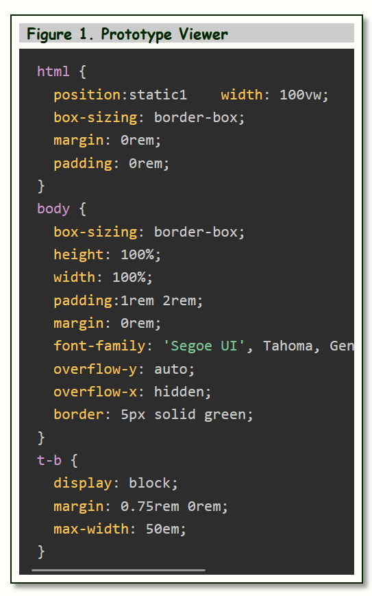

# CodeViewerComponent

A zero-dependency vanilla JavaScript [W3C Web Component](https://www.w3.org/TR/components-intro/) that displays a titled, framed code block with click-to-resize interaction.  It is implemented as a Custom Element with Shadow DOM encapsulation — both part of the W3C Web Components standard — so it works as a native HTML element in any modern browser with no framework required.

The component has two rendering modes: a **plain mode** that displays literal text (suitable for any language or markup), and a **Prism mode** that delegates to [Prism.js](https://prismjs.com/) for syntax highlighting.  Clicking the code block widens it; clicking the title bar narrows it.

## Demo

Open `CodeViewerComponent.html` in a browser to see the component floating beside body text with interactive width control.



## Installation

Copy `js/CodeViewer.js` into your project and load it with a script tag.  Optionally include `css/CodeViewer.css` for default host-page placement margins.

```html
<script src="path/to/CodeViewer.js" defer></script>
<link rel="stylesheet" href="path/to/CodeViewer.css">  <!-- optional -->
```

For Prism syntax highlighting, also load Prism before `CodeViewer.js`:

```html
<link rel="stylesheet" href="path/to/prism.css">
<script src="path/to/prism.js"></script>
<script src="path/to/CodeViewer.js" defer></script>
```

## Usage

### Plain mode (default)

Supply code as a `<template slot="code">`.  The template's inner HTML is serialized as literal text — tags and all — so it is safe to embed any language including HTML and CSS without escaping.

```html
<code-viewer width="30rem" bg-color="#1e1e1e" color="#d4d4d4" title-bg-color="#333">
  Figure 1. Hello World
  <template slot="code">
fn main() {
    println!("Hello, world!");
}
  </template>
</code-viewer>
```

### Prism mode

Set `highlight="prism"` and `language="<lang>"`.  Supply the code in a `<pre><code>` block inside `slot="code"`.  Prism must be loaded before the component script.

```html
<code-viewer highlight="prism" language="rust" width="40rem" title-bg-color="#ccc">
  Figure 2. Ownership example
  <pre slot="code"><code class="language-rust">
fn main() {
    let s = String::from("hello");
    let t = s;          // s moves into t
    println!("{}", t);
}
  </code></pre>
</code-viewer>
```

Both modes support the `trim` and `normalize-indent` attributes (see below).

## API

### Attributes

All attributes are fully reactive — changing them after the element is in the DOM updates the display immediately.

#### Visuals

| Attribute | Default | Description |
|-----------|---------|-------------|
| `bg-color` | `white` | Background color of the component frame. |
| `title-bg-color` | `transparent` | Background color of the title bar. |
| `background-color` | `#333` | Background color of the code area. |
| `color` | `#eee` | Text color of the code area (plain mode). |

#### Code area sizing

| Attribute | Default | Description |
|-----------|---------|-------------|
| `width` | auto | Initial width of the code area.  Accepts any CSS length: `px`, `rem`, `ch`, `%`. |
| `height` | auto | Height of the code area.  Useful for fixed-height scrollable blocks. |
| `overflow-x` | `auto` | Horizontal overflow of the code area (`auto`, `scroll`, `hidden`). |
| `code-padding` | `0.75rem 1rem` | Padding inside the code area. |

#### Typography

| Attribute | Default | Description |
|-----------|---------|-------------|
| `font-family` | inherited | Font family applied to the code area. |
| `font-size` | inherited | Font size applied to the code area. |

#### Prism highlighting

| Attribute | Default | Description |
|-----------|---------|-------------|
| `highlight` | — | Set to `"prism"` to enable Prism syntax highlighting. |
| `language` | — | Language identifier passed to Prism (e.g. `"rust"`, `"python"`, `"javascript"`). |

#### Content transforms

Boolean attributes (presence enables the transform, absence disables it).

| Attribute | Description |
|-----------|-------------|
| `trim` | Strips leading and trailing blank lines from the code text. |
| `normalize-indent` | Removes the common leading whitespace from every line, eliminating indentation introduced by embedding code inside deeply nested HTML. |

### Slots

| Slot | Description |
|------|-------------|
| *(default)* | Text content placed directly in `<code-viewer>` becomes the title bar caption. |
| `code` | The code to display.  In plain mode, use `<template slot="code">`.  In Prism mode, use `<pre slot="code"><code>`. |

### CSS Custom Properties

The component reads two CSS custom properties from the host page for theme integration:

| Property | Used for | Fallback |
|----------|----------|----------|
| `--light` | Outer wrapper background | `white` |
| `--dark` | Border color and title text | `#333` |

```css
:root {
  --light: #f5f0e8;
  --dark:  #2c2c2c;
}
```

### Shadow DOM Parts

Two named parts are exposed for external styling:

```css
code-viewer::part(component) {
  border-radius: 6px;
}

code-viewer::part(title) {
  font-size: 0.8rem;
  letter-spacing: 0.04em;
}
```

### Interaction

| Action | Effect |
|--------|--------|
| Click the code block | Widens the code area by 40 px. |
| Click the title bar | Narrows the code area by 40 px. |

Width is stepped relative to the natural rendered width on first click.  The minimum enforced width is 240 px.  Repeated clicks accumulate, allowing the block to be sized to any width.

## Browser Support

`CodeViewerComponent` uses three W3C Web Component specifications:

| Specification | Purpose |
|---------------|---------|
| [Custom Elements v1](https://www.w3.org/TR/custom-elements/) | Defines `<code-viewer>` as a native HTML element |
| [Shadow DOM v1](https://www.w3.org/TR/shadow-dom/) | Encapsulates internal styles and structure |
| [HTML Slots](https://html.spec.whatwg.org/multipage/scripting.html#the-slot-element) | Exposes the title (default) and `code` insertion points |

Supported in all modern browsers (Chrome, Edge, Firefox, Safari).

## File Structure

```
CodeViewerComponent/
├── CodeViewerComponent.html   demo page
├── js/
│   └── CodeViewer.js          component source (~455 lines)
└── css/
    └── CodeViewer.css         optional host-page placement styles
```

## License

&copy; James Fawcett — use freely with attribution.
